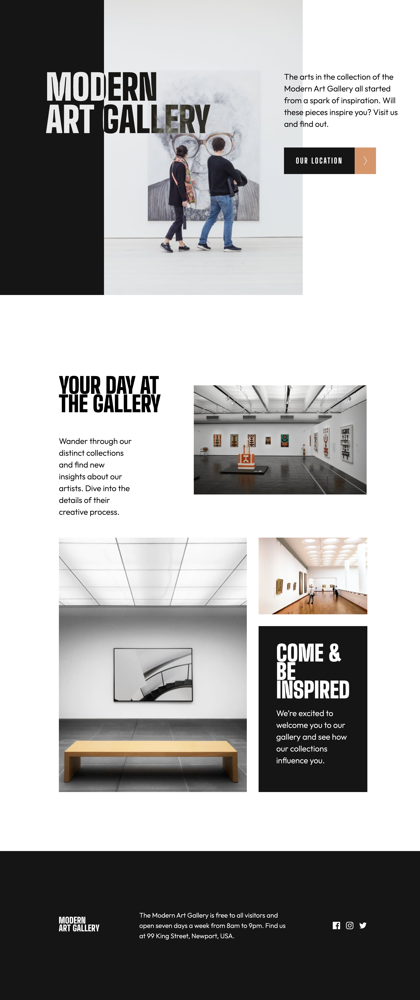

# Frontend Mentor - Art gallery website solution

This is a solution to the [Art gallery website challenge on Frontend Mentor](https://www.frontendmentor.io/challenges/art-gallery-website-yVdrZlxyA). Frontend Mentor challenges help you improve your coding skills by building realistic projects. 

## Table of contents

- [Overview](#overview)
  - [The challenge](#the-challenge)
  - [Screenshot](#screenshot)
  - [Links](#links)
- [My process](#my-process)
  - [Built with](#built-with)
  - [What I learned](#what-i-learned)
  - [Useful resources](#useful-resources)
- [Author](#author)

## Overview

### The challenge

Users should be able to:

- View the optimal layout for each page depending on their device's screen size
- See hover states for all interactive elements throughout the site
- **Bonus**: Use [Leaflet JS](https://leafletjs.com/) to create an interactive location map with custom location pin

### Screenshot



### Links

- Live Site URL: [Add live site URL here](https://your-live-site-url.com)

## My process

### Built with

- Semantic HTML5 markup
- CSS custom properties
- Flexbox
- CSS Grid
- Mobile-first workflow


### What I learned

Diving into this project, I've sharpened my skills with CSS Grid, which has been a game-changer for designing responsive gallery sections. CSS Grid's flexibility in handling layout adjustments helped me ensure everything stayed proportionate and tidy, enhancing the overall user experience.

Here’s a quick example:


```css
  .gallery-bottom {
    display: grid;
    grid-template-columns: repeat(8, minmax(0, 1fr));
    margin-top: 2rem;
    gap: 2rem;
  }
```


### Useful resources

- W3 Schools
- Stackoverflow


## Author

- Website - [Add your name here](https://www.your-site.com)

